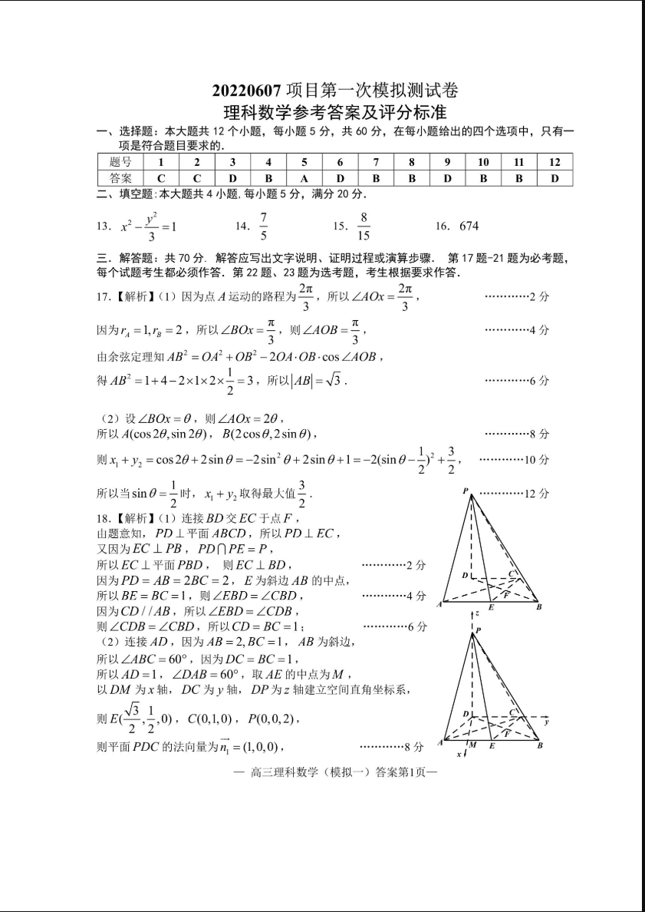
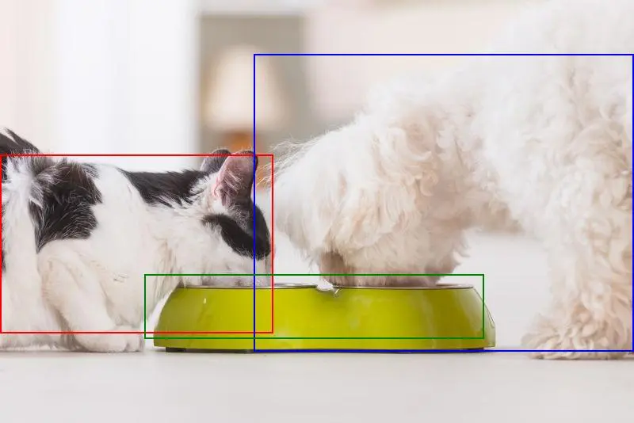

# Ming-Lite-Omni-Preview

<p align="center">
    
<p>

<p align="center">🤗 <a href="https://huggingface.co/inclusionAI">Hugging Face</a>| 🤖 <a href="https://modelscope.cn/organization/inclusionAI">ModelScope</a>


## Introduction

Ming-Lite-Omni-Preview is built upon [Ling-Lite](https://github.com/inclusionAI/Ling), which is a MoE model designed to perceive a wide range of modalities, including text, images, audio, and video, while generating text and natural speech in a streaming manner. To naturely handle the diverse modalities, we have enhanced Ling-Lite by incorporating modality-specific routers for each modality. As a result, Ming-Omni excels at handling information from diverse modalities and is highly scalable.

<p align="center">
    
<p>


## Key Features

- **Omni and Novel MoE Architecture**: An innovative Omni architecture based on Mixture of Experts (MoE) that achieves competive performance across multiple modality benchmarks.

- **Video understanding**: Supports KV-Cache dynamic compression of visual tokens. While supporting the ability to understand long videos of hours, it can also provide more detailed understanding of short videos of a few seconds.

- **Natural Speech Generation and Fine-grained Voice Dialogue**: Supports dialect understanding and generation in end-to-end conversations, enables one-shot voice cloning, and enhances prosody through audio tokenizer compression


## Evaluation

### Image benchmark
<div align="center">

| Benchmarks       | Ming-Lite-Omni-Preview | Qwen2.5-VL-7B-Instruct | InternVL2.5-8B-MPO |
| :--------------- | :--------------------: | :--------------------: | :----------------: |
| AI2D             |         83.84          |          83.9          |    <b>84.5</b>     |
| HallusionBench   |      <b>54.68</b>      |          51.9          |        51.7        |
| MMBench_TEST_V11 |         79.63          |      <b>84.3</b>       |        82.0        |
| MMMU             |          57.0          |      <b>58.6</b>       |        54.8        |
| MMStar           |          62.0          |          63.9          |    <b>65.2</b>     |
| MMVet            |      <b>73.6</b>       |          67.1          |        68.1        |
| MathVista        |      <b>69.0</b>       |          68.2          |        67.9        |
| OCRBench         |          87.9          |          86.4          |    <b>88.2</b>     |
| Average          |      <b>70.96</b>      |          70.5          |        70.3        |

</div>


#### Object Recognition
<div align="center">

| Object Recognition          | Ming-Lite-Omni-Preview | Qwen2.5-VL-7B | InternVL-2.5-8B |
| :-------------------------- | :--------------------: | :-----------: | :-------------: |
| Plants                      |          52.1          |  <b>55.3</b>  |      32.8       |
| Animals                     |          52.6          |  <b>54.8</b>  |      36.5       |
| Home appliances & furniture |          93.5          |  <b>97.4</b>  |      90.9       |
| Personal Electronics        |      <b>96.1</b>       |     95.1      |      93.2       |
| Food & Ingredients          |          57.5          |  <b>60.0</b>  |      48.7       |
| Tableware                   |        <b>96.6         |     94.9      |      88.1       |
| Vehicles                    |          31.9          |  <b>40.9</b>  |      31.9       |
| Average                     |          68.6          |  <b>71.2</b>  |      60.3       |

</div>


### Video benchmark

<div align="center">

| Benchmarks         | Ming-Lite-Omni-Preview |   Qwen2.5VL-7B   |
| :----------------- | :--------------------: | :--------------: |
| VideoMME wo/w sub. |       63.9/67.6        | <b>65.1/71.6</b> |
| MVBench            |          67.0          |   <b>72.0</b>    |
| Video-MMMU         |          45.4          |   <b>47.44</b>   |
| LongVideoBench     |          53.7          |   <b>60.0</b>    |
</div>


### Audio benchmark
#### SpeechQA

<div align="center">

| Model                  | AlpacaEval  | CommonEval  |    SD-QA     |     MMSU     |  OpenBookQA  |    IFEval    |   AdvBench    |
| :--------------------- | :---------: | :---------: | :----------: | :----------: | :----------: | :----------: | :-----------: |
| Qwen2-Audio-chat       |    3.69     |    3.40     |    35.35     |    35.43     |    49.01     |    22.57     |     98.85     |
| Baichuan-Audio         |    4.00     |    3.39     |    49.64     |    48.80     |    63.30     |    41.32     |     86.73     |
| GLM-4-Voice            |    4.06     |    3.48     |    43.31     |    40.11     |    52.97     |    24.91     |     88.08     |
| Kimi-Audio             |    4.46     | <b>3.97</b> | <b>63.12</b> |    62.17     | <b>83.52</b> | <b>61.10</b> | <b>100.00</b> |
| Qwen2.5-Omni           | <b>4.49</b> |    3.93     |    55.71     | <b>61.32</b> |    81.10     |    52.87     |     99.42     |
| Ming-Lite-Omni-Preview |    4.25     |    3.88     |    58.95     |    46.06     |    60.00     |    46.71     |     96.53     |
</div>

#### ASR

<div align="center">

| **Model**              | **Aishell-1** | **Aishell-2 ios** | **Wenetspeech test-net** | **Wenet test-meeting** | **Librispeech test-clean** | **Librispeech test-other** |
| :--------------------- | :-----------: | :---------------: | :----------------------: | :--------------------: | :------------------------: | :------------------------: |
| Whisper Large-v3       |     5.14      |       4.76        |           9.68           |         18.54          |            1.9             |            3.65            |
| Qwen2-Audio            |     1.53      |       3.06        |           7.72           |          8.4           |         <b>1.6</b>         |            3.6             |
| GLM-4-voice Base       |     2.46      |         -         |            -             |           -            |            2.82            |            7.66            |
| Baichuan-Omni-1.5      |       -       |         -         |           6.9            |          8.4           |             -              |             -              |
| Qwen2.5-Omni           |  <b>1.18</b>  |    <b>2.36</b>    |        <b>5.9</b>        |          7.7           |            1.8             |         <b>3.4</b>         |
| Ming-Lite-Omni-Preview |     1.62      |       2.82        |           6.23           |       <b>6.9</b>       |            2.34            |            5.74            |

</div>


### Knowledge
<div align="center">

| Model                  | InfoSeek_H-mean | InfoSeek_unseen_question | InfoSeek_unseen_entity |
| :--------------------- | :-------------: | :----------------------: | :--------------------: |
| GPT-4o                 |  <b>36.05</b>   |            -             |           -            |
| PaLI-X                 |      22.06      |           23.5           |          20.8          |
| Qwen2.5-vl-32B         |      19.35      |          20.55           |         18.28          |
| Ming-Lite-Omni-Preview |      27.3       |           28.9           |          25.9          |
</div>


### OCR&GUI
<div align="center">

| Model            | Ming-Lite-Omni-Preview | Qwen2.5-VL-7B-Instruct |
| :--------------- | :--------------------: | :--------------------: |
| ChartQA_TEST     |          85.2          |      <b>87.3</b>       |
| DocVQA_TEST      |          93.2          |      <b>95.7</b>       |
| OCRBenchV2_en/zh |       52.2/51.6        |    <b>56.3/57.2</b>    |
| OmniDocBench↓    |       34.7/34.5        |    <b>30.8/39.8</b>    |
| TextVQA_VAL      |         82.36          |      <b>84.9</b>       |
| ScreenSpot       |          79.3          |      <b>84.7</b>       |
</div>


## Model Downloads

You can download the model from both Huggingface and ModelScope.

<div align="center">

| **Model**              |   **Input modality**    | **Oput modality** |                                                                            **Download**                                                                            |
| :--------------------- | :---------------------: | :---------------: | :----------------------------------------------------------------------------------------------------------------------------------------------------------------: |
| Ming-Lite-Omni-Preview | Image,text,viedio,audio | Image,text,audio  | [🤗 HuggingFace](https://huggingface.co/inclusionAI/Ming-Lite-Omni-Preview) <br>[🤖 ModelScope](https://www.modelscope.cn/models/inclusionAI/Ming-Lite-Omni-Preview) |
</div>
If you're in mainland China, we strongly recommend you to download our model from 🤖 <a href="https://modelscope.cn/organization/inclusionAI">ModelScope</a>.


## Use Cases

### OCR

| MultiModal Input                                                             | QA                                                                                                                                                                                                                                                                                                                                                                                                                                                                                                                                                                                                                                                                                                  |
| ---------------------------------------------------------------------------- | --------------------------------------------------------------------------------------------------------------------------------------------------------------------------------------------------------------------------------------------------------------------------------------------------------------------------------------------------------------------------------------------------------------------------------------------------------------------------------------------------------------------------------------------------------------------------------------------------------------------------------------------------------------------------------------------------- |
| <p align="center">  </p>      | Q: 提取小票的内容。 <br>A: <details><summary>日期：2016-12-01 18:14 机号：039</summary>单号：000056 收银员：0121<br>货号 数量*单价 金额<br>味全每日C胡萝卜蔬果原汁300ml<br> 146838 1*6.00 6.00<br>味全每日C果纤橙汁300ml<br>348959 2*6.30 12.60<br>味全每日C葡萄柚蔬汁300ml <br>283051 1*6.00 6.00<br>（促）*伊利草莓+桑葚大果粒酸奶260g <br>307344 1*5.80 5.80<br>蒙牛大果粒酸奶芦荟+黄桃260g <br>323518 1*8.60 8.60<br>炫迈动鲜果味口香糖50.4g <br>484083 1*9.50 9.50<br>博士2017年日历本BSD201716<br>567542 1*36.90 36.90<br>中号购物袋 <br>561601 1*0.30 0.30<br>购买件数：9 应付金额：85.70<br>现金 106.00<br>实收金额：106.00找零：20.30<br>会员卡号：2101033****<br>可用积分：168 </details> |
| <p align="center">  </p> | Q: 输出给定图像文本的markdown格式。<br>A: <p align="center">  </p>                                                                                                                                                                                                                                                                                                                                                                                                                                                                                                                                                                        |


### Grounding

| MultiModal Input                                                                | QA                                                                                                                                                                                                                                                                                                                                                                                                                                                                                                                                                                                                                                                                                                                                                                                                                  |
| ------------------------------------------------------------------------------- | ------------------------------------------------------------------------------------------------------------------------------------------------------------------------------------------------------------------------------------------------------------------------------------------------------------------------------------------------------------------------------------------------------------------------------------------------------------------------------------------------------------------------------------------------------------------------------------------------------------------------------------------------------------------------------------------------------------------------------------------------------------------------------------------------------------------- |
| <p align="center">  </p> | Q: Where is the Shih Tzu in the image? Answer in [x0, y0, x1, y1] format.<br>A: [0, 608, 100, 923]<br><p align="left"> </p>                                                                                                                                                                                                                                                                                                                                                                                                                                                                                                                                                                                                                              |
| <p align="center">  </p> | Q: Describe the image with grounding.<br>A: In the image, a \<boxes alt="cat" bbox="[0, 366, 431, 788]"\>cat\</boxes\> and a \<boxes alt="dog" bbox="[400, 129, 999, 830]"\>dog\</boxes\> are sitting next to each other, eating from the same \<boxes alt="dish" bbox="[228, 649, 763, 800]"\>dish\</boxes\>. They appear to be sharing a meal together. The cat is positioned on the left side of the dish, while the dog is on the right side. Both animals seem to be enjoying their food, creating a peaceful scene of interspecies companionship. The background is blurred, focusing attention on the interaction between the two pets. This image captures a moment of harmony between a cat and a dog sharing a meal.<br><p align="left">  </p> |

### GUI

| MultiModal Input                                                                      | QA                                                                                                            |
| ------------------------------------------------------------------------------------- | ------------------------------------------------------------------------------------------------------------- |
| <p align="center">  </p> | Q: In the given image, could you find and tell me the coordinates of search bar?<br>A: click(x=0.384,y=0.082) |

### Object Recognition(animal,plant...)

| MultiModal Input                                                           | QA                                                                                                                                                                                                                                                                                                                                                                                                                                                                                                                                                                                                                                                                      |
| -------------------------------------------------------------------------- | ----------------------------------------------------------------------------------------------------------------------------------------------------------------------------------------------------------------------------------------------------------------------------------------------------------------------------------------------------------------------------------------------------------------------------------------------------------------------------------------------------------------------------------------------------------------------------------------------------------------------------------------------------------------------- |
| <p align="center">  </p> | Q: What animal is this?<br>A: This is a longhorn beetle. The insect in the image has a distinctive black body with white spots, which is characteristic of many longhorn beetle species. Its long, slender antennae are a key identifying feature of longhorn beetles. These beetles are known for their elongated bodies and antennae, which can be quite impressive in size compared to their body. Cerambycidae family and are found in various parts of the world, often in forested areas.                                                                                                                                                                         |
| <p align="center">  </p>  | Q: What plant is this??<br>A: This plant is a Dendrobium nobile, commonly known as the Noble Dendrobium or Chinese Dendrobium. It's a species of orchid native to Southeast Asia, particularly found in countries like China, India, and Southeast Asian countries.\n\nDendrobium nobile is known for its beautiful, fragrant flowers that typically bloom in clusters. The flowers are usually white or pale pink with a yellow center, which matches the description of the plant in the image.\n\nThis orchid is highly prized in horticulture and is often grown as a houseplant or in orchid collections. It's also used in traditional medicine in some cultures. |

### Knowledge QA

| MultiModal Input                                                               | QA                                                                                                                  |
| ------------------------------------------------------------------------------ | ------------------------------------------------------------------------------------------------------------------- |
| <p align="center">  </p> | Q: Who or what maintains this place?<br>A: The place is Ribblehead Viaduct, so the required answer is Network Rail. |
| <p align="center">  </p> | Q: Which country does this sport come from?<br>A: The sport is curling, so the required answer is Scotland.         |

### MultiModal Reasoning

| MultiModal Input                                                                                                                          | QA                                                                                                                                                                                                                                                                                                                                                                                                                                                                                                                                                                                                                                                                                                                                                                                                                                                                                                                                                                                                                                                                                                                                                                                                                                                                                                                                                                                                                                                                                                                                                                                                                                                                                                                                                                                                                                                                                                                                                                                                                                                                                                                                                                                                                                                                                                                                                                                                                                                                                                                                                                                                                                                                                                                                                                                                                                                                     |
| ----------------------------------------------------------------------------------------------------------------------------------------- | ---------------------------------------------------------------------------------------------------------------------------------------------------------------------------------------------------------------------------------------------------------------------------------------------------------------------------------------------------------------------------------------------------------------------------------------------------------------------------------------------------------------------------------------------------------------------------------------------------------------------------------------------------------------------------------------------------------------------------------------------------------------------------------------------------------------------------------------------------------------------------------------------------------------------------------------------------------------------------------------------------------------------------------------------------------------------------------------------------------------------------------------------------------------------------------------------------------------------------------------------------------------------------------------------------------------------------------------------------------------------------------------------------------------------------------------------------------------------------------------------------------------------------------------------------------------------------------------------------------------------------------------------------------------------------------------------------------------------------------------------------------------------------------------------------------------------------------------------------------------------------------------------------------------------------------------------------------------------------------------------------------------------------------------------------------------------------------------------------------------------------------------------------------------------------------------------------------------------------------------------------------------------------------------------------------------------------------------------------------------------------------------------------------------------------------------------------------------------------------------------------------------------------------------------------------------------------------------------------------------------------------------------------------------------------------------------------------------------------------------------------------------------------------------------------------------------------------------------------------------------- |
| <p align="center">  </p> | Q: In the rectangle $A B C D$ pictured, $M_{1}$ is the midpoint of $D C, M_{2}$ the midpoint of $A M_{1}, M_{3}$ the midpoint of $B M_{2}$ and $M_{4}$ the midpoint of $C M_{3}$. Determine the ratio of the area of the quadrilateral $M_{1} M_{2} M_{3} M_{4}$ to the area of the rectangle $A B C D$.<br>Choices:<br>(A) $\frac{7}{16}$<br>(B) $\frac{3}{16}$<br>(C) $\frac{7}{32}$<br>(D) $\frac{9}{32}$<br>(E) $\frac{1}{5}$<br>A: <details><summary>\<think\><br></summary> Okay, so I have this problem about a rectangle ABCD. The image shows a rectangle with points M1, M2, M3, and M4 inside it. M1 is the midpoint of DC, M2 is the midpoint of AM1, M3 is the midpoint of BM2, and M4 is the midpoint of CM3. I need to find the ratio of the area of quadrilateral M1M2M3M4 to the area of the rectangle ABCD.<br>First, let's consider the coordinates of the points. Let's place the rectangle ABCD on a coordinate system with A at (0,0), B at (a,0), C at (a,b), and D at (0,b).<br>- M1 is the midpoint of DC, so its coordinates are ((a/2), b).<br>- M2 is the midpoint of AM1. The coordinates of A are (0,0) and M1 are ((a/2), b). The midpoint M2 is ((a/4), b/2).<br>- M3 is the midpoint of BM2. The coordinates of B are (a,0) and M2 are ((a/4), b/2). The midpoint M3 is ((5a/8), b/4).<br>- M4 is the midpoint of CM3. The coordinates of C are (a,b) and M3 are ((5a/8), b/4). The midpoint M4 is ((13a/16), 5b/8).<br>Now, we need to find the area of quadrilateral M1M2M3M4. We can use the shoelace formula for this. The coordinates of the points are:<br>- M1: ((a/2), b)<br>- M2: ((a/4), b/2)<br>- M3: ((5a/8), b/4)<br>- M4: ((13a/16), 5b/8)<br>Using the shoelace formula:<br>Area = 1/2 \| (x1y2 + x2y3 + x3y4 + x4y1) - (y1x2 + y2x3 + y3x4 + y4x1) \|<br>Substituting the coordinates:<br>Area = 1/2 \| ((a/2)(b/2) + (a/4)(b/4) + (5a/8)(5b/8) + (13a/16)(b)) - (b(a/4) + (b/2)(5a/8) + (b/4)(13a/16) + (5b/8)(a/2)) \|<br>Simplifying each term:<br>- (a/2)(b/2) = ab/4<br>- (a/4)(b/4) = ab/16<br>- (5a/8)(5b/8) = 25ab/64<br>- (13a/16)(b) = 13ab/16<br>- b(a/4) = ab/4<br>- (b/2)(5a/8) = 5ab/16<br>- (b/4)(13a/16) = 13ab/64<br>- (5b/8)(a/2) = 5ab/16<br>Combining the terms:<br>- First part: ab/4 + ab/16 + 25ab/64 + 13ab/16 = (16ab + 4ab + 25ab + 52ab)/64 = 97ab/64<br>- Second part: ab/4 + 5ab/16 + 13ab/64 + 5ab/16 = (16ab + 20ab + 13ab + 20ab)/64 = 69ab/64<br>Subtracting the second part from the first part:<br>Area = 1/2 \| 97ab/64 - 69ab/64 \| = 1/2 \| 28ab/64 \| = 1/2 * 28ab/64 = 14ab/64 = 7ab/32<br>The area of the rectangle ABCD is ab. Therefore, the ratio of the area of quadrilateral M1M2M3M4 to the area of the rectangle ABCD is 7ab/32 divided by ab, which is 7/32.<br>So, the correct answer is C.<br>\</think\> <br></details> \<answer\><br>\boxed{C}<br>\</answer\><br> |


### Video Understanding

| MultiModal Input                                              | QA                                                                                                                                                                                                                                                                                                                                                                                                                                                                                                                                                                                                                                                                                                                                                                                                                                 |
| ------------------------------------------------------------- | ---------------------------------------------------------------------------------------------------------------------------------------------------------------------------------------------------------------------------------------------------------------------------------------------------------------------------------------------------------------------------------------------------------------------------------------------------------------------------------------------------------------------------------------------------------------------------------------------------------------------------------------------------------------------------------------------------------------------------------------------------------------------------------------------------------------------------------- |
| [long video_url](https://youtu.be/AOshmqVwSjk)                | Q: Describe the video.<br>A: <details><summary>The video begins with a white screen displaying the text "Excerpt from a biomedical animation project." <br></summary>  The scene then transitions to a close-up of a cell, which is shown in detail as it divides and multiplies. The animation then focuses on the mitochondria, which are shown in blue and red, and the intermembrane space, which is shown in gray. The video then shows the different components of the mitochondria, including the outer membrane, inner membrane, and intermembrane space. The animation then shows the different proteins and enzymes that are involved in the process of ATP synthesis, including NADH, coenzyme Q, cytochrome c, and ATP synthase. The video ends with a white screen displaying the text "CORTICAL STUDIOS." </details> |
| [long video_url](https://www.youtube.com/watch?v=-0aM99dMu_4) | Q: On an image with a white background, there is densely packed black English text. The top line has the letters 'NAMICAL DISTANCE FUNCTIONS', and in the third line of the screen, there is another line of distance functions. When 'in time step I and then they simply' is mentioned, what change occurs to this line of distance functions?<br>Options:<br>A. It turns red, and the latter part is circled in red for annotation<br>B. It turns red, and the latter part is circled in yellow for annotation<br>C. It turns yellow, and the latter part is circled in red for annotation<br>D. It turns yellow, and the latter part is circled in yellow for annotation<br>Only give the best option.<br>A: B.                                                                                                                |


### Video-Audio-QA

| MultiModal Input                                                                                                                          | QA                                                                                                                                                                                                                        |
| ----------------------------------------------------------------------------------------------------------------------------------------- | ------------------------------------------------------------------------------------------------------------------------------------------------------------------------------------------------------------------------- |
| <video src="https://github.com/user-attachments/assets/a1327779-030a-44d0-a073-bbc1abe04efc" controls width="70%" height="auto" ></video> | Q: [\<audio\>](./figures/cases/audioqa_audio.wav) (audio content: 请描述视频内容。)<br>A: The video features a woman performing a series of yoga poses on a rooftop with a scenic view of mountains and a clear blue sky. |
| <video src="https://github.com/user-attachments/assets/bdeb43ce-9048-4dc1-897c-aa1d7b6f3836" controls width="70%" height="auto" ></video> | Q: Is there any food in front of me? <br>A: Yes, there's candy on the table.                                                                                                                                              |


### Speech2Speech (supports dialect)
<video src="https://github.com/user-attachments/assets/842e3e18-ee4a-47ea-ba92-a009be5cf2a3" controls width="70%" height="auto"></video>


## Quickstart

Please download our model following [Model Downloads](#model-downloads), then you can refer to the following codes to run Ming-Lite-Omni-Preview model.

```python
import os
from transformers import AutoProcessor
from models import BailingMMNativeForConditionalGeneration

# build model
model = BailingMMNativeForConditionalGeneration.from_pretrained(
    "Ming-Omni-18B-A3-Preview ",
    torch_dtype=torch.bfloat16,
    low_cpu_mem_usage=True
).to("cuda")

assets_path = YOUR_ASSETS_PATH

# build processor
processor = AutoProcessor.from_pretrained("Ming-lite-preview", trust_remote_code=True)
```

```python
# qa
messages = [
    {
        "role": "HUMAN",
        "content": [
            {"type": "text", "text": "请详细介绍鹦鹉的生活习性。"}
        ],
    },
]
# Output:

# 鹦鹉是一种非常聪明和社交性强的鸟类，它们的生活习性非常丰富和有趣。以下是一些关于鹦鹉生活习性的详细介绍：
# ### 1. **栖息地**
# 鹦鹉主要分布在热带和亚热带地区，包括非洲、亚洲、澳大利亚和南美洲。它们通常生活在森林、草原、沙漠和城市环境中。不同种类的鹦鹉对栖息地的要求有所不同，但大多数鹦鹉喜欢有丰富植被和水源的地方。
# ### 2. **饮食**
# 鹦鹉是杂食性动物，它们的饮食非常多样化。它们的食物包括种子、坚果、水果、蔬菜、花蜜和昆虫。鹦鹉的喙非常强壮，能够轻松地打开坚硬的果壳和坚果。一些鹦鹉还会吃泥土或沙子，以帮助消化和补充矿物质。
# ......

```

```python
# image qa
messages = [
    {
        "role": "HUMAN",
        "content": [
            {"type": "image", "image": os.path.join(assets_path, "flowers.jpg")},
            {"type": "text", "text": "What kind of flower is this?"},
        ],
    },
]
# Output:

# The flowers in this image are forget-me-nots. These delicate blooms are known for their small, five-petaled flowers that come in various shades of blue, pink, and white.
```

To enable thinking before response, adding the following system prompt before your question:

```python
cot_prompt = "SYSTEM: You are a helpful assistant. When the user asks a question, your response must include two parts: first, the reasoning process enclosed in <thinking>...</thinking> tags, then the final answer enclosed in <answer>...</answer> tags. The critical answer or key result should be placed within \\boxed{}.\n"
# And your input message should be like this:
messages = [
    {
        "role": "HUMAN",
        "content": [
            {"type": "image", "image": os.path.join(assets_path, "reasoning.png")},
            {"type": "text", "text": cot_prompt + "In the rectangle $A B C D$ pictured, $M_{1}$ is the midpoint of $D C, M_{2}$ the midpoint of $A M_{1}, M_{3}$ the midpoint of $B M_{2}$ and $M_{4}$ the midpoint of $C M_{3}$. Determine the ratio of the area of the quadrilateral $M_{1} M_{2} M_{3} M_{4}$ to the area of the rectangle $A B C D$.\nChoices:\n(A) $\frac{7}{16}$\n(B) $\frac{3}{16}$\n(C) $\frac{7}{32}$\n(D) $\frac{9}{32}$\n(E) $\frac{1}{5}$"},
        ],
    },
]
# Output:
# \<think\>\nOkay, so I have this problem about a rectangle ABCD ... (thinking process omitted) ... So, the correct answer is C.\n\</think\>\n\<answer\>\\boxed{C}\</answer\>\n\n
```

```python
# video qa
messages = [
    {
        "role": "HUMAN",
        "content": [
            {"type": "video", "video": os.path.join(assets_path, "yoga.mp4")},
            {"type": "text", "text": "What is the woman doing?"},
        ],
    },
]
# Output:

# The image shows a woman performing a yoga pose on a rooftop. She's in a dynamic yoga pose, with her arms and legs extended in various positions.

```

```python
# multi-turn chat
messages = [
    {
        "role": "HUMAN",
        "content": [
            {"type": "text", "text": "中国的首都是哪里？"},
        ],
    },
    {
        "role": "ASSISTANT",
        "content": [
            {"type": "text", "text": "北京"},
        ],
    },
    {
        "role": "HUMAN",
        "content": [
            {"type": "text", "text": "它的占地面积是多少？有多少常住人口？"},
        ],
    },
]
# Output:

# 北京市的总面积约为16,410.54平方公里，常住人口约为21,542,000人。
```

```python
# Preparation for inference
text = processor.apply_chat_template(messages, add_generation_prompt=True)
image_inputs, video_inputs, audio_inputs = processor.process_vision_info(messages)
inputs = processor(
    text=[text],
    images=image_inputs,
    videos=video_inputs,
    audios=audio_inputs,
    return_tensors="pt",
)
inputs = inputs.to(model.device)
for k in inputs.keys():
    if k == "pixel_values" or k == "pixel_values_videos" or k == "audio_feats":
        inputs[k] = inputs[k].to(dtype=torch.bfloat16)

# call generate
generated_ids = model.generate(
    **inputs,
    max_new_tokens=512,
    use_cache=False,
    eos_token_id=processor.gen_terminator,
)
generated_ids_trimmed = [
        out_ids[len(in_ids):] for in_ids, out_ids in zip(inputs.input_ids, generated_ids)
    ]
output_text = processor.batch_decode(
    generated_ids_trimmed, skip_special_tokens=True, clean_up_tokenization_spaces=False
)[0]
print(output_text)
```


```python
# ASR
messages = [
    {
        "role": "HUMAN",
        "content": [
            {"type": "text", "text": "Please recognize the language of this speech and transcribe it. Format: oral."},
            {"type": "audio", "audio": 'data/wavs/BAC009S0915W0292.wav'},
        ],
    },
]
outputs = model.generate(messages, max_new_tokens=512)
print(outputs)
```

```python
# speech2speech
messages = [
    {
        "role": "HUMAN",
        "content": [
            {"type": "audio", "audio": 'data/wavs/BAC009S0915W0292.wav'},
        ],
    },
]
outputs = model.generate(messages, max_new_tokens=512, speaker='luna', output_audio_path='out.wav', output_audio=True)
print(outputs)
```


## License and Legal Disclaimer

This code repository is licensed under the [MIT License](../LICENSE), and the Legal Disclaimer is located in the [LEGAL.md file](../LEGAL.md) under the project's root directory.
