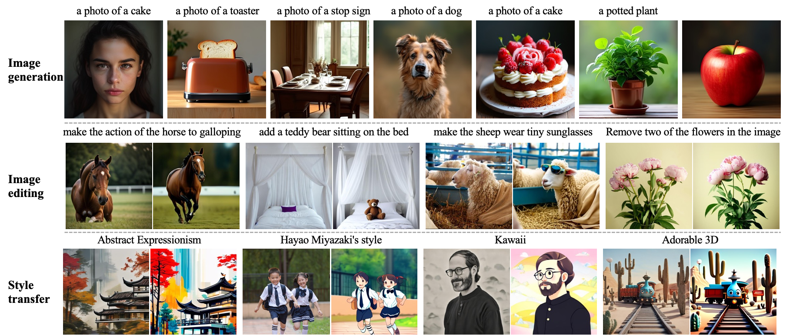

<h1 align="center">Ming-Lite-Uni: Advancements in Unified Architecture for Natural Multimodal Interaction</h1>

<p align="center">
          🤗 <a href="https://huggingface.co/inclusionAI/Ming-Lite-Uni">Hugging Face</a>&nbsp&nbsp |
          &nbsp&nbsp🤖 <a href="https://modelscope.cn/models/inclusionAI/Ming-Lite-Uni">ModelScope</a>&nbsp&nbsp |
          &nbsp&nbsp 📑 <a href="https://arxiv.org/pdf/2505.02471">Paper</a>
</p>

`Ming-Lite-Uni` is an open-source multimodal framework that includes a newly developed unified visual generator, and a native multimodal autoregressive model meant to integrate vision and language.

This project offers an open-source implementation of the integrated MetaQueries and M2-omni framework, while offering the innovative **multi-scale learnable tokens** and **multi-scale representation alignment strategy**. Ming-Lite-Uni utilizes a fixed MLLM and a learnable diffusion model, allowing native multimodal AR models to execute text-to-image production and instruction-based image editing tasks, hence enhancing their functionalities beyond mere visual comprehension. Our experimental findings demonstrate the robust efficacy of Ming-Lite-Uni and highlight the remarkable fluidity of its interactive process. Ming-Lite-Uni is now in the alpha phase and will soon undergo additional refinement.

We appreciate everyone's ongoing support and attention! We sincerely value your patience as we progressively enhance our solutions and model efficacy. We are now achieving significant progress and observing favorable outcomes, with forthcoming updates anticipated—remain attentive!

## &#x1F4CC; Updates

* [2025.05.03] 🔥 Our [Technical Report](https://arxiv.org/pdf/2505.02471) is in public on arxiv.
* [2025.05.03] 🔥 We release the fisrt version of [Ming-Lite-Uni](https://github.com/inclusionAI/Ming).

## Why It Matters

Ming-Lite-Uni's unified architecture overcomes fundamental limitations of conventional approaches:

| Conventional Methods                                          | Ming-Lite-Uni's Advantages                                                          |
| ------------------------------------------------------------- | ----------------------------------------------------------------------------------- |
| **Modular Pipelines**<br>(CLIP/SigLIP + Diffusion Models)     | **End-to-End Unified Model**<br>Seamless understanding-generation integration       |
| **Discrete Token AR**<br>(Limited visual grounding)           | **Continuous Token Space**<br>Native support for fine-grained visual concepts       |
| **Fixed-Resolution Processing**<br>(Artifacts in upscaling)   | **Multi-Scale Adaptation**<br>Consistent quality across resolutions                 |
| **Separate Editing Workflows**<br>(Manual alignment required) | **Dialog-Driven Control**<br>Natural language guided pixel-level editing            |
| **Understanding Bottlenecks**<br>(Visual-semantic mismatch)   | **Joint Representation Learning**<br>Mutually enhanced comprehension and generation |


## Key Enhancements

- **Unified Visual Understanding & Generation Architecture.** Ming-Lite-Uni achieves an average understanding score of 69.7 on the OpenCompass leaderboard, surpassing DeepSeek-VL2 (66.4). At the same time, it achieves an image generation score of 0.62 on the GenEval benchmark, outperforming SDXL (0.55).
- **Multi-Scale Learnable Tokens.** We employ a novel mechanism to establish feature correlations across resolutions of 4×/8×/16×. By introducing **hierarchical tokens**, the model captures global layout (low-res), object structures (mid-res), and fine textures (high-res), improving GenEval by 3.5%.
- **Multi-Scale Representation Alignment.** We introduce a novel **scale wised consistency loss** to enforce alignment between hierarchical representations and final outputs through native-resolution optimization. This strategy directly enhances the high-res reconstruction quality (>2dB PSNR) and boosts GenEval by 1.5%.
- **AGI-Capable System.** Our model supports complex chained operations, such as "generate castle → add sunset → adjust perspective", with a swift response time of under 1 second (benchmarked with RTX 4090). The system is designed to handle instruction-driven generation-editing and is synchronized with ChatGPT-4o(aligned with the industry milestone of March 2025).


## Empowering Multimodal Interaction with Ming-Lite-Uni
**Ming-Lite-Uni** acts as a unified model for multimodal understanding, extending beyond traditional NLP tasks and multimodal comprehension to enable interactive multimodal generation. This includes capabilities such as image generation, image editing, and style transfer.




## Model Structure
**Ming-Lite-Uni** is a unified multimodal model designed for both image understanding and high-fidelity image generation. It achieves this by compressing image representations into continuous visual tokens, which are processed alongside discrete text tokens using a scaled auto-regressive Transformer. The generation capability is powered by an externally trained diffusion model (SANA), conditioned on tokens produced by the Transformer.


## Benchmark Evaluations
We conduct separate quantitative evaluations of Ming-Lite-Uni on multimodal understanding and text-to-image generation using public benchmarks. For multimodal understanding, we compare against traditional models that take images and text as input and output text, as well as against recent models with visual generative capabilities. For multimodal generation, we evaluate text-to-image performance on GenEval. Please refer to our TechReport for details.

**Multimodal Understanding**

| Type              | Model                    | Avg. | MMB  | MMS  | MMMU | MathV | Hall | AI2D | MM-Vet |
| ----------------- | ------------------------ | ---- | ---- | ---- | ---- | ----- | ---- | ---- | ------ |
| **Und. Only**     | LLaVA-72B                | 68.0 | 84.5 | 65.8 | 56.6 | 68.4  | 47.9 | 86.2 | 60.6   |
|                   | Qwen2.5-VL-7B            | 76.2 | 87.8 | 71.1 | 67.9 | 70.8  | 58.8 | 88.2 | 76.7   |
|                   | Emu3-Chat                | -    | 58.5 | -    | 31.6 | -     | -    | -    | 37.2   |
|                   | InternVL2.5-78B          | 75.2 | 87.5 | 69.5 | 70   | 71.4  | 57.4 | 89.1 | 71.8   |
|                   | DeepSeek-VL2             | 66.4 | 81.2 | 61.0 | 50.7 | 59.4  | 51.5 | 84.5 | 60.0   |
|                   | GPT-4o-20241120 (closed) | 72.0 | 84.3 | 65.1 | 70.7 | 59.9  | 56.2 | 84.9 | 74.5   |
|                   | Step-1o (closed)         | 77.7 | 87.3 | 69.3 | 69.9 | 74.7  | 55.8 | 89.1 | 82.8   |
| **Und. and Gen.** | TokenFlow-XL             | -    | 68.9 | -    | 38.7 | -     | -    | -    | 40.7   |
|                   | Janus-Pro-7B             | -    | 79.2 | -    | 41.0 | -     | -    | -    | 50.0   |
|                   | **Ours (Ming-Lite-Uni)** | 69.7 | 80.7 | 60.5 | 51.2 | 68.3  | 51.8 | 84.5 | 72.3   |


**Image Generation**

| Type              | Method                   | Single Obj. | Two Obj. | Counting | Colors | Position | Color Attri. | Overall |
| ----------------- | ------------------------ | ----------- | -------- | -------- | ------ | -------- | ------------ | ------- |
| **Gen. Only**     | LlamaGen                 | 0.71        | 0.34     | 0.21     | 0.58   | 0.07     | 0.04         | 0.32    |
|                   | SDv2.1                   | 0.98        | 0.51     | 0.44     | 0.85   | 0.07     | 0.17         | 0.50    |
|                   | Emu3-Gen                 | 0.98        | 0.71     | 0.34     | 0.81   | 0.17     | 0.21         | 0.54    |
|                   | SDXL                     | 0.98        | 0.74     | 0.39     | 0.85   | 0.15     | 0.23         | 0.55    |
|                   | DALL-E 3                 | 0.96        | 0.87     | 0.47     | 0.83   | 0.43     | 0.45         | 0.67    |
|                   | SD3-Medium               | 0.99        | 0.94     | 0.72     | 0.89   | 0.33     | 0.60         | 0.74    |
| **Und. and Gen.** | Show-o                   | 0.95        | 0.52     | 0.49     | 0.82   | 0.11     | 0.28         | 0.53    |
|                   | TokenFlow-XL             | 0.95        | 0.60     | 0.41     | 0.81   | 0.16     | 0.24         | 0.55    |
|                   | Janus-Pro-1B             | 0.98        | 0.82     | 0.51     | 0.89   | 0.65     | 0.56         | 0.73    |
|                   | **Ours (Ming-Lite-Uni)** | 0.99        | 0.76     | 0.53     | 0.87   | 0.26     | 0.30         | 0.62    |

## Example Usage
#### System Requirements
- **Python:** >= 3.8
- **PyTorch:** >= 2.4.1+cu12.2 (CUDA 12.2 compatible)
- **flash-attn:** >= 2.6.3
#### Installation

We recommend installing the following versions to set up your environment using pip:

```
pip install -r requirements.txt
```

- ### Usage Guided
Below is an example of how to load and use the model:
```python
import torch
import os
from Ming_Uni.MingUniInference import Ming_Uni_Inference
from Ming_Uni.process import MyProcessor
device = torch.cuda.current_device()
device = torch.device(device)

model_path='../Ming-Lite-Uni/'
model = Ming_Uni_Inference(model_path)
model.to(torch.bfloat16)
model.to(device)
model.eval()

llm_model=os.path.join(model_path, 'qwen2_5_llm')
my_proc=MyProcessor(llm_model)

image_file = "tests/cake.jpg"
prompt = "add a candle on top of the cake"
inputs = my_proc.process(image_file=image_file, prompt=prompt, device=device)

result = model.image_gen_generate(inputs, steps=30, seed=42, cfg=5.0, height=512, width=512)[1]
result.save("result.png")
```
For more advanced usage, such as fine-tuning or generating images, refer to the documentation.


## Acknowledgments

The project is currently in its early stages. While some preliminary results have been promising, substantial progress is needed to achieve seamless integration of understanding and generation. Both the code and models require further refinement and optimization, which is why we have chosen to open-source the project. We invite contributions from the community to help enhance and develop it collaboratively. If you have any suggestions or identify issues within the code, please contribute via Pull Requests. Thank you for your support and interest!

## Open Collaboration
We're open-sourcing Ming-Lite-Uni to accelerate progress toward AGI, featuring:
- 📂 Full model weights & test code
- 🧩 Modular architecture for easy extension
- 📊 Comprehensive benchmarks (vs GPT-4V, SDXL, etc.)

*"The simultaneous release of ChatGPT-4's image generation in March 2025 confirms our vision of unified multimodal AI as the next paradigm."*

## Contact Information

If you require assistance or encounter troubles while utilizing our project, please open a GitHub issue.

## License and Legal Disclaimer

Ming is licensed under the [MIT License](../LICENSE), and the Legal Disclaimer is located in the [LEGAL.md file](../LEGAL.md) under the project's root directory.

## Citation

If you find our work helpful, feel free to give us a cite.

```bibtex
@article{Mingunify2025,
    title   = {Ming-Lite-Uni: Advancements in Unified Architecture for Natural Multimodal Interaction},
    author  = {Inclusion AI, Ant Group},
    journal = {arXiv preprint},
    year    = {2025}
}
```
