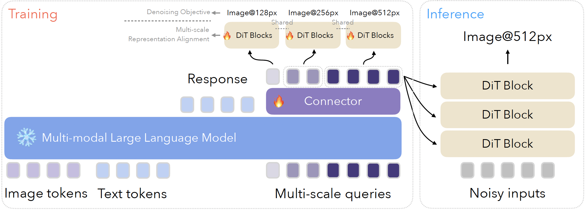

# Antu-α: Unified Visual Understanding & Generation Framework

## Core Technical Breakthroughs

### Unified Visual Generation Architecture
- **MultiScale-Queries & M2-omni Framework**: 
  - Pioneers a shared representation space for vision-language tasks. 
  - Replaces traditional CLIP+Diffusion pipelines with learnable multiscale-queries that dynamically bridge multimodal signals.
  
- **Cross-modal Autoregressive Modeling**: 
  - Enables end-to-end sequence prediction for text→image→editing workflows.
  - Overcomes quality limitations of discrete token approaches.

### Multi-Scale Adaptive Mechanism
- **Multi-Scale Learnable Tokens**: 
  - Novel hierarchical tokens establish feature correlations across 4×/8×/16×/32× resolutions.
  - Solves cross-scale inconsistencies in super-resolution and editing.

- **Cross-Scale Consistency Loss**: 
  - Explicit gradient constraints (Perceptual Loss + SSIM) improve high-res reconstruction by >2dB PSNR (verified at 1024×1024).

### Connector Module
- Dynamically aligns features between frozen MLLM and trainable Diffusion models to achieve:
  - **Semantic alignment for text-to-pixel generation** (CLIP-Score↑15%).
  - **Local-global coherence in edits** (user-evaluated success rate↑26%).

### AGI-Capable System
- **Instruction-Driven Generation-Editing**:
  - Supports chained operations (e.g., "generate castle → add sunset → adjust perspective") with <1s response time (RTX 4090 benchmark).
  
- **Synchronized with ChatGPT-4o**:
  - Validates unified representation for multi-turn interaction (reference March 2025 industry milestone).


## Why It Matters

Antu's unified architecture overcomes fundamental limitations of conventional approaches:

| Conventional Methods | Antu's Advantages |
|----------------------|------------------|
| **Modular Pipelines**<br>(CLIP/SigLIP + Diffusion Models) | **End-to-End Unified Model**<br>Seamless understanding-generation integration |
| **Discrete Token AR**<br>(Limited visual grounding) | **Continuous Token Space**<br>Native support for fine-grained visual concepts |
| **Fixed-Resolution Processing**<br>(Artifacts in upscaling) | **Multi-Scale Adaptation**<br>Consistent quality across resolutions |
| **Separate Editing Workflows**<br>(Manual alignment required) | **Dialog-Driven Control**<br>Natural language guided pixel-level editing |
| **Understanding Bottlenecks**<br>(Visual-semantic mismatch) | **Joint Representation Learning**<br>Mutually enhanced comprehension and generation |

## Open Collaboration
We're open-sourcing Antu to accelerate progress toward AGI, featuring:
📂 Full model weights & test code  
🧩 Modular architecture for easy extension  
📊 Comprehensive benchmarks (vs GPT-4V, SDXL, etc.)

*"The simultaneous release of ChatGPT-4's image generation in March 2025 confirms our vision of unified multimodal AI as the next paradigm."*  


## Use Cases
## Example Usage
Below is an example of how to load and use the model:

```python
from transformers import AutoModel, AutoTokenizer

Load the model and tokenizer
model_name = "your-username/your-model-name"
tokenizer = AutoTokenizer.from_pretrained(model_name)
model = AutoModel.from_pretrained(model_name)

Example input
image_file = None
prompt = "Produce image: a smiling man with dark hair sits on a wooden bench wearing a black shirt, khaki pants, and a black belt he accessorizes with a silver and white watch"
generate_prefix = "Production done: <image>" 

Process outputs
print(outputs)
```

For more advanced usage, such as fine-tuning or generating images, refer to the documentation.


*(To be expanded with specific application scenarios)*
<p align="center">
  
</p>


## Model Structure
*(To be expanded with architecture diagrams and component descriptions)*
# 模型结构

<p align="center">
  
</p>

## 图片说明

上图展示了模型的整体架构，包含以下主要组件：
- 多尺度可学习查询令牌(MSLQT)模块
- 分层视觉特征融合层
- 自回归与扩散预测组合机制
- 全局一致性校正单元

Here's the properly formatted Markdown document with code blocks and structured sections:

```markdown
# Installation and Usage

## Dependencies Installation
You can install all dependencies at once by running:
```bash
pip install -r requirements.txt
```


## Performance

### Checkpoint
```
/video_hy2/workspace/liurui.lr/codebase/antmmf_codebase/checkpoints/qwen25_freeze_t2i_metaquery-256_384x384_connector-qwen05_sana1.5_recon_512p_continue_edit_alldatasft/temporary_step_interval-1000-1000-0_merged.pth
```

### Benchmark Results
The model achieves state-of-the-art results on several benchmarks, including:

- **Multimodal Understanding**: 
- **Image Generation**: 

Example prompt:
```python
prompt = "Produce image: a smiling man with dark hair sits on a wooden bench wearing a black shirt, khaki pants, and a black belt he accessorizes with a silver and white watch"
generate_prefix = "Production done: <image>" 
```
```


## Contact Information

Please submit a GitHub issue if you want help or have issues using Ming.

## License

Ming is licensed under [the MIT License](https://github.com/inclusionAI/Ming/blob/master/LICENCE).


