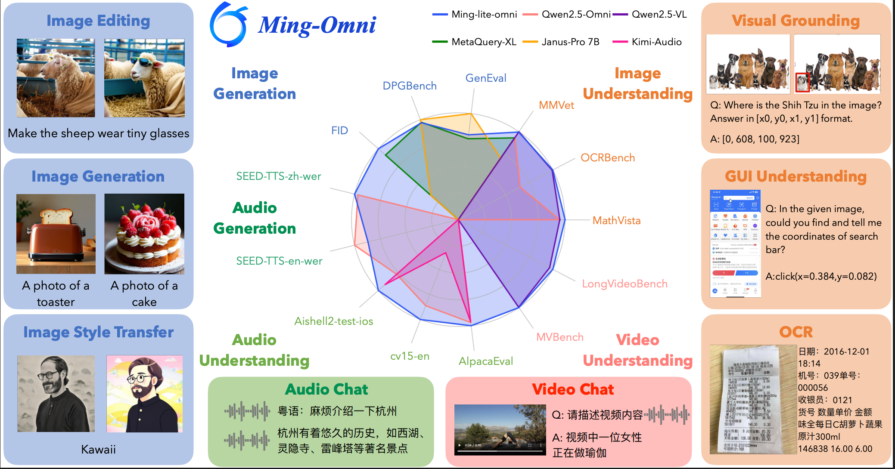
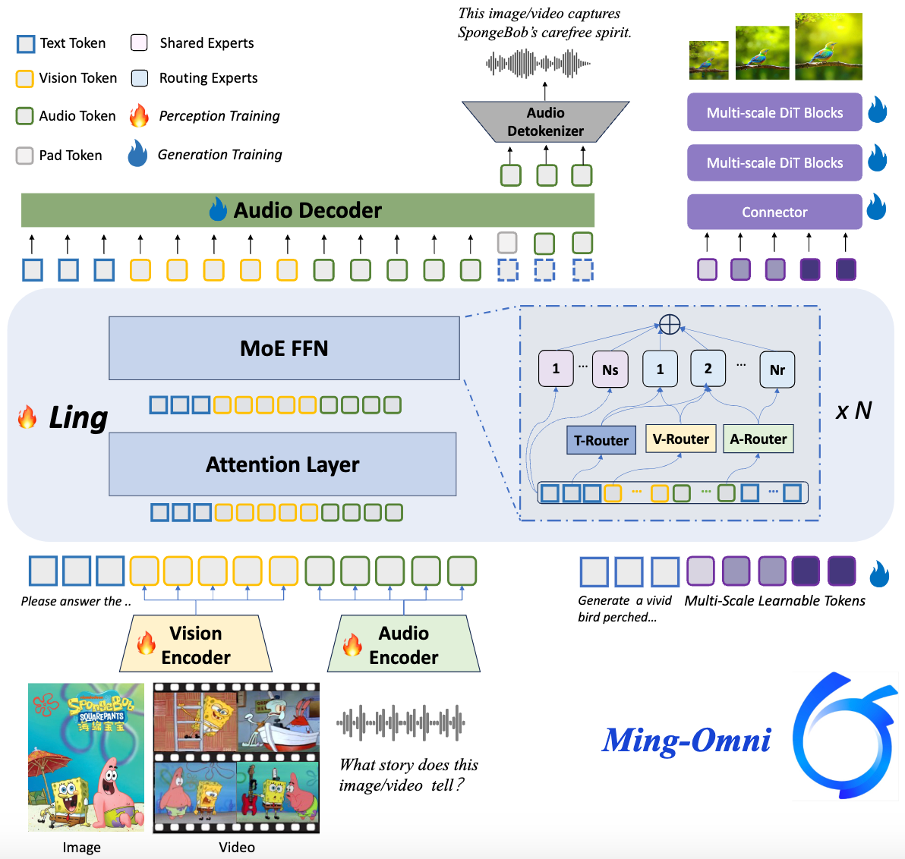

# Ming-Lite-Omni v1.5

<p align="center">
    
<p>

<p align="center">📑 <a href="https://arxiv.org/abs/2506.09344">Technical Report</a>｜📖<a href="https://lucaria-academy.github.io/Ming-Omni/">Project Page</a> ｜🤗 <a href="https://huggingface.co/inclusionAI/Ming-Lite-Omni-1.5">Hugging Face</a>｜ 🤖 <a href="https://www.modelscope.cn/models/inclusionAI/Ming-Lite-Omni-1.5">ModelScope</a>


## Introduction

Ming-lite-omni v1.5 is a comprehensive upgrade to the full-modal capabilities of [Ming-lite-omni](https://github.com/inclusionAI/Ming/tree/v1.0). It significantly improves performance across tasks including image-text understanding, document understanding, video understanding, speech understanding and synthesis, and image generation and editing. Built upon [Ling-lite-1.5](https://github.com/inclusionAI/Ling), Ming-lite-omni v1.5 has a total of 20.3 billion parameters, with 3 billion active parameters in its MoE (Mixture-of-Experts) section. It demonstrates highly competitive results in various modal benchmarks compared to industry-leading models.

<p align="center">
    
<p>

## 📌 Updates

* [2025.07.15] 🔥 We release [Ming-lite-omni v1.5](https://inclusionai.github.io/blog/ming-lite-omni-1_5/) with significant improvements across all modalities.
* [2025.06.12] 🔥 Our [Technical Report](https://arxiv.org/abs/2506.09344) is in public on arxiv.
* [2025.05.28] 🔥 The official version of [Ming-lite-omni v1](https://github.com/inclusionAI/Ming/tree/v1.0) is released, with better performance and image generation support.
* [2025.05.04] 🔥 We release the test version of Ming-lite-omni：[Ming-lite-omni-Preview](https://github.com/inclusionAI/Ming/tree/Ming-Lite-Omni-Preview).


## Key Features
Compared to [Ming-lite-omni](https://github.com/inclusionAI/Ming/tree/v1.0), Ming-lite-omni v1.5 features key optimizations in the following 3 areas:
- **Enhanced Video Understanding—MRoPE & Curriculum Learning**: Ming-lite-omni v1.5 significantly improves video understanding through MRoPE's 3D spatiotemporal encoding and a curriculum learning strategy for handling long videos, enabling precise comprehension of complex visual sequences.
- **Refined Multi-modal Generation-Consistency & Perception Control**: Ming-lite-omni v1.5 offers superior generation, featuring dual-branch image generation with ID & Scene Consistency Loss for coherent editing, and perception enhancement for detailed visual control. Its new audio decoder and BPE encoding also deliver high-quality, real-time speech synthesis.
- **Comprehensive Data Upgrades-Broadened & Refined fine-grained Data**: Ming-lite-omni v1.5's capabilities are built on extensive data upgrades, including new structured text data, expanded high-quality product information, and refined fine-grained visual and speech perception data (including dialects). This provides a richer, more accurate foundation for all modalities.

<p align="center">
    
<p>

##  Evaluation
In various modality benchmark tests, Ming-lite-omni v1.5 demonstrates highly competitive results compared to industry-leading models of similar scale.

### Image-text Understanding
Ming-lite-omni v1.5 shows significant improvements in general image-text understanding, visual object localization, and universal object recognition capabilities, providing a more powerful base model for a wide range of visual applications.

| Task Type        | Dataset                                                                                           | Qwen2.5-VL-7B | Ming-lite-omni v1.5 |
|------------------|---------------------------------------------------------------------------------------------------|---------------|----------------|
| **OpenCompass**  | AI2D                                                                                              | 84.36         | **84.91**          |
|                  | HallusionBench                                                                                    | 55.77         | 54.59          |
|                  | MMBench_TEST_V11                                                                                  | 82.75         | 80.73          |
|                  | MMMU                                                                                              | 56.56         | 54.33          |
|                  | MMStar                                                                                            | 65.27         | 65.07          |
|                  | MMVet                                                                                             | 71.61         | **73.99**          |
|                  | MathVista                                                                                         | 68.10         | **72.00**          |
|                  | OCRBench                                                                                          | 87.80         | **88.90**          |
|                  | average                                                                                           |  71.5 | **71.8** |
| **Localization** | RefCOCO_val/testA/testB                                                                           | 90.00/92.5.85.4     | **91.40**/**93.2**/**87.1**          |
|                  | RefCOCO+_val/testA/testB                                                                          | 84.20/89.1/76.9         | **86.30**/**90.5**/**79.2**         |
|                  | RefCoCog_val/test                                                                                 |  **87.2**/**87.2** | 87.1/87.6 |
| **Recognition**  | General Recognition                                                                               | 92.42         | **92.53**          |
|                  | Vertical domains for natural encyclopedias (animals, plants, ingredients, vehicles, dishes, etc.) | 47.79         | **54.27**          |

### Document Understanding
Ming-lite-omni v1.5 generally performs on par with Qwen2.5-VL-7B in complex document understanding tasks. Notably, it achieves SOTA results among models under 10B parameters on OCRBench, which focuses on text-visual understanding, and on ChartQA, which requires in-depth chart visual analysis and logical reasoning.

| Task Type                                          | dataset             | Qwen2.5-VL-7B | Ming-lite-omni v1 | Ming-lite-omni v1.5 |
|:---------------------------------------------------|:--------------------| :------------ | :----------- | :------------- |
| OCR Understanding                                  | ChartQA_test        | 87.24         | 85.1        | **88.84**          |
|                                                    | DocVQA_test         | **95.57**         | 93.0        | 93.68          |
|                                                    | TextVQA_val         | **85.06**         | 82.8        | 82.27          |
|                                                    | OCRBench            | 87.8          | 88.4        | **88.90**          |
|                                                    | Average             | **88.91**         | 87.32       | 88.42          |
| Document Analysis                                  | OmniDocBench↓ en/zh | **30.8**/39.8     | 34 /34.4      | 34.9/**34.9**      |
| OCR Comprehensive Capability                       | OCRBenchV2 en/zh    | 56.3/57.2     | 53.3/52     | 52.1/55.2      |


### Video Understanding
Ming-lite-omni v1.5 achieves a leading position among models of its size in video understanding tasks.

| Benchmark              | Qwen2.5-VL-7B | Qwen2.5-Omni-7B | InternVL3-8B | **Ming-lite-omni v1.5** |
|:-----------------------| :------------: | :--------------: | :----------: | :----------------: |
| **VideoMME(w/o subs)** |     65.10      |      64.30       |    66.30     |     **67.07**      |
| **VideoMME(w/ subs)**  |     71.60      |      72.40       |    68.90     |     **72.59**      |
| **VideoMME(avg)**      |     68.35      |      68.35       |    67.60     |     **69.83**      |
| **MVBench**            |     69.60      |      70.30       |  **75.40**   |       69.43        |
| **LongVideoBench**     |     56.00      |      54.82       |    58.80     |     **59.54**      |
| **OvOBench**           |     51.10      |      50.46       |    51.91     |     **52.17**      |


### Speech Understanding

Ming-lite-omni v1.5 further improves upon Ming-lite-omni in speech understanding. It supports English, Mandarin, Cantonese, Sichuanese, Shanghainese, Minnan, and other dialects, maintaining an industry-leading position in open-source English and Mandarin ASR (Automatic Speech Recognition) and Audio QA (Question Answering) tasks.

- ASR Task

| Model              | Average on All/Open-source Benchmarks(↓) | aishell1 | aishell2_test_android | aishell2_test_ios | cv15_zh | fleurs_zh | wenetspeech_testmeeting | wenetspeech_testnet | librispeech_test_clean | librispeech_test_other | multilingual_librispeech | cv15_en | fleurs_en | voxpopuli_v1.0_en | speechio_leaderboard | dialect_hunan | dialect_minnan | dialect_guangyue | dialect_chuanyu | dialect_shanghai | noisy_jrgj | zxb_chat | zxb_govern | zxb_health | zxb_knowledge | zxb_local_live |
|:-------------------|:-----------------------------------------| :------- | :-------------------- | :---------------- | :------ | :-------- | :---------------------- | :------------------ | :--------------------- | :--------------------- | :----------------------- | :------ | :-------- | :---------------- | :------------------- | :------------ | :------------- | :--------------- | :-------------- | :--------------- | :--------- | :------- | :--------- | :--------- | :------------ | :------------- |
| Ming-lite-omni-1.5 | 4.67(+0.15)/3.83(+0.05)                  | 1.3      | 2.47                  | 2.46              | 5.66    | 2.87      | 6.19                    | 5.24                | 1.25                   | 2.61                   | 4.14                     | 6.95    | 3.28      | 6.43              | 2.81                 | 6.96          | 12.74          | 3.7              | 3.8             | 9.95             | 10.9       | 2.6      | 1.77       | 2.97       | 3.41          | 1.88           |
| Ming-lite-omni     | 4.82/3.88                                | 1.47     | 2.55                  | 2.52              | 6.31    | 2.96      | 5.95                    | 5.46                | 1.44                   | 2.80                   | 4.15                     | 6.89    | 3.39      | 5.80              | 2.65                 | 7.88          | 13.84          | 4.36             | 4.33            | 10.49            | 11.62      | 2.34     | 1.77       | 3.31       | 3.69          | 2.44           |
| Qwen2.5-Omni       | 8.81/ 4.37                               | 1.18     | 2.75                  | 2.63              | 5.2     | 3.0       | 5.9                     | 7.7                 | 1.8                    | 3.4                    | 7.56                     | 7.6     | 4.1       | 5.8               | 2.54                 | 29.31         | 53.43          | 10.39            | 7.61            | 32.05            | 11.11      | 3.68     | 2.23       | 4.02       | 3.17          | 2.03           |
| Qwen2-Audio        | 12.34 / 5.41                             | 1.53     | 2.92                  | 2.92              | 6.9     | 7.5       | 7.16                    | 8.42                | 1.6                    | 3.6                    | 5.40                     | 8.6     | 6.90      | 6.84              | -                    | 25.88         | 123.78         | 7.59             | 7.77            | 31.73            | -          | 4.29     | 2.70       | 4.18       | 3.33          | 2.34           |
| Kimi-Audio         | 12.75/4.42                               | 0.60     | 2.64                  | 2.56              | 7.21    | 2.69      | 6.28                    | 5.37                | 1.28                   | 2.42                   | 5.88                     | 10.31   | 4.44      | 7.97              | 2.23                 | 31.93         | 80.28          | 41.49            | 6.69            | 60.64            | 24.40      | 2.96     | 2.03       | 2.38       | 1.98          | 2.05           |

- Speech QA Task

| Model                     | Average(Open-ended QA) | AlpacaEval | CommonEval | SD-QA | MMSU  | OpenBookQA | IFEval | AdvBench |
|:--------------------------|:-----------------------| :--------- | :--------- | :---- | :---- | :--------- | :----- | :-------- |
| Ming-lite-omni v1.5[omni] | 4.474(+0.134)          | 4.648      | 4.3        | 61.16 | 45.77 | 65.934     | 55.599 | 98.076  |
| Ming-lite-omni[omni]      | 4.34                   | 4.63       | 4.06       | 58.84 | 47.53 | 61.98      | 58.36  | 99.04   |
| MiniCPM-o [omni]          | 4.285                  | 4.42       | 4.15       | 50.72 | 54.78 | 78.02      | 49.25  | 97.69   |
| Kimi-Audio [audio]        | 4.215                  | 4.46       | 3.97       | 63.12 | 62.17 | 83.52      | 61.10  | 100.00  |
| Qwen2.5-Omni [omni]       | 4.21                   | 4.49       | 3.93       | 55.71 | 61.32 | 81.10      | 52.87  | 99.42   |
| GLM-4-Voice [audio]       | 3.77                   | 4.06       | 3.48       | 43.31 | 40.11 | 52.97      | 24.91  | 88.08   |
| Qwen2-Audio-chat [audio]  | 3.545                  | 3.69       | 3.40       | 35.35 | 35.43 | 49.01      | 22.57  | 98.85   |
| Step-Audio-chat [audio]   | 3.49                   | 3.99       | 2.99       | 46.84 | 31.87 | 29.19      | 65.77  | 86.73   |

### Speech Generation
Ming-lite-omni v1.5 shows significant improvement over Ming-lite-omni in English and Mandarin voice cloning tasks.

| Model           | seed-tts-eval-zh_wer | seed-tts-eval-zh_sim | seed-tts-eval-en_wer | seed-tts-eval-en_sim |
|:---------------:|:--------------------:|:--------------------:|:--------------------:|:--------------------:|
| Seed-TTS        |         1.11         | 0.796                |         2.24         | 0.762                |
| MaskGCT         |         2.27         | 0.774                |         2.62         | 0.714                |
| E2 TTS          |         1.97         | 0.730                |         2.19         | 0.710                |
| F5-TTS          |         1.56         | 0.741                |         1.83         | 0.647                |
| CosyVoice 2     |         1.45         | 0.748                |         2.57         | 0.652                |
| Qwen2.5-Omni-7B |         1.70         | 0.752                |         2.72         | 0.632                |
| Ming-lite-omni       |   1.69                  | 0.68                 | 4.31                  | 0.509                |
| Ming-lite-omni v1.5 |  1.93                  | 0.68                 | 3.75                  | 0.54                 |


### Image Generation
Ming-lite-omni v1.5 demonstrates significant advantages in maintaining scene and person ID consistency during human image editing. It also expands its support for perception tasks such as generative segmentation, depth prediction, object detection, and edge contour generation.

| Gen-eval            | 1-Obj | 2-Obj | Counting | Colors | Position | Color Attr | Avg. |
|---------------------| :---:   | :---:   | :---:      | :---: |:---: |:---: |:---: |
| Ming-lite-omni      | 0.99   | 0.77   | 0.68      | 0.78 | 0.46 |0.42 |0.64 |
| Ming-lite-omni v1.5 | 0.99   | 0.93   | 0.86      | 0.87 |0.90 |0.66 |0.87 |  


+ Human image editing

| prompt                                                                                                                                                                                                     | ours | Qwen-VLo |
|------------------------------------------------------------------------------------------------------------------------------------------------------------------------------------------------------------| --- | --- |
| Make the person in the image smile slightly without altering the original structure  |  |  |

- Generative segmentation 

| input | Segmentation | Semantic Segmantation | Panoptic Segmentation |
|  ---     | --- | --- | --- |
|  | <br/>prompt: Given the following instructions: little girl, pink, your monitors colors off friend p pink shirt girl; please perform referring segmentation on this image. | <br/>prompt: Please segment different **classes** in this image | <br/>prompt: Please segment different **instances** in this image. |


+ Edge contour generation

| Input                                                                                                                               | Depth Map                                                                                                                            | Detection Box | Contour |
|---|--------------------------------------------------------------------------------------------------------------------------------------| --- | --- |
|  |   |  |  |


## Model Downloads

You can download our latest model from both Huggingface and ModelScope. For previous version model like [Ming-Lite-Omni v1](https://github.com/inclusionAI/Ming/tree/v1.0), Please refer to this [link](https://github.com/inclusionAI/Ming/tree/v1.0?tab=readme-ov-file#model-downloads).

<div align="center">

| **Model**          |   **Input modality**   | **Oput modality** |                                                                         **Download**                                                                         |
|:-------------------|:----------------------:| :---------------: |:------------------------------------------------------------------------------------------------------------------------------------------------------------:|
| Ming-Lite-Omni-1.5 | Image,text,video,audio | Image,text,audio  | [🤗 HuggingFace](https://huggingface.co/inclusionAI/Ming-Lite-Omni-1.5) <br>[🤖 ModelScope](https://www.modelscope.cn/models/inclusionAI/Ming-Lite-Omni-1.5) |
</div>
If you're in mainland China, we strongly recommend you to download our model from 🤖 <a href="https://www.modelscope.cn/models/inclusionAI/Ming-Lite-Omni-1.5">ModelScope</a>.

```
pip install modelscope
modelscope download --model inclusionAI/Ming-Lite-Omni-1.5 --local_dir inclusionAI/Ming-Lite-Omni-1.5  --revision master
```

Note: This download process will take several minutes to several hours, depending on your network conditions.


## Use Cases

Additional demonstration cases are available on our project [page](https://lucaria-academy.github.io/Ming-Omni/).


## Environment Preparation


### Installation with pip
```shell
pip install -r requirements.txt
# for python 3.10
pip install data/matcha_tts-0.0.5.1-cp310-cp310-linux_x86_64.whl 
# for python 3.8 
# pip install data/matcha_tts-0.0.5.1-cp38-cp38-linux_x86_64.whl
pip install diffusers==0.33.0
pip install nvidia-cublas-cu12==12.4.5.8  # for H20 GPU
```

### Installation with docker

You can also initialize the environment by building the docker image. First clone this repository:
```shell
git clone --depth 1 https://github.com/inclusionAI/Ming.git
cd Ming
```
Then build the docker image with the provided Dockerfile in `docker/docker-py310-cu121`. This step might take a while:
```shell
docker build -t ming:py310-cu121 docker/docker-py310-cu121
```
At last, start the container with the current repo directory mounted:
```shell
docker run -it --gpus all -v "$(pwd)":/workspace/Ming ming:py310-cu121 ming:py310-cu121 /bin/bash
```
You can run the model with python interface. You may download the huggingface model in the repo directory first (`.../Ming/`) or mount the downloaded model path when starting the container.


## Example Usage

We provide a step-by-step running example:

Step 1 - Download the source code
```
git clone https://github.com/inclusionAI/Ming.git 
cd Ming
```
Step 2 - Download the model weights and create a soft link to the source code directory

Download our model following [Model Downloads](#model-downloads)

```shell
mkdir inclusionAI 
ln -s /path/to/inclusionAI/Ming-Lite-Omni-1.5 inclusionAI/Ming-Lite-Omni
```

Step 3 - Enter the code directory, you can refer to the following codes to run the Ming-Lite-Omni model.
```shell
jupyter notebook cookbook.ipynb
```

We also provide a simple example on the usage of this repo. For detailed usage, please refer to [cookbook.ipynb](https://github.com/inclusionAI/Ming/blob/main/cookbook.ipynb).

```python
import torch
from transformers import AutoProcessor, GenerationConfig
from modeling_bailingmm import BailingMMNativeForConditionalGeneration

# load model
model = BailingMMNativeForConditionalGeneration.from_pretrained(
    "inclusionAI/Ming-Lite-Omni",
    torch_dtype=torch.bfloat16,  # Use bfloat16 for memory efficiency
    attn_implementation="flash_attention_2",
    load_image_gen=True,
    low_cpu_mem_usage=True       # Minimize CPU memory during loading
).to("cuda")  


# build processor
processor = AutoProcessor.from_pretrained(".", trust_remote_code=True)

# qa
messages = [
    {
        "role": "HUMAN",
        "content": [
            {"type": "text", "text": "请详细介绍鹦鹉的生活习性。"}
        ],
    },
]

# 1. Format inputs using chat template
text = processor.apply_chat_template(messages, add_generation_prompt=True)

# 2. Extract vision/audio data
image_inputs, video_inputs, audio_inputs = processor.process_vision_info(messages)

# 3. Prepare tensor inputs
inputs = processor(
    text=[text],
    images=image_inputs,
    videos=video_inputs,
    audios=audio_inputs,
    return_tensors="pt",
)
inputs = inputs.to(model.device)
for k in inputs.keys():
    if k == "pixel_values" or k == "pixel_values_videos" or k == "audio_feats":
        inputs[k] = inputs[k].to(dtype=torch.bfloat16)

# 4. Configure generation
generation_config = GenerationConfig.from_dict({'no_repeat_ngram_size': 10})
generated_ids = model.generate(
    **inputs,
    max_new_tokens=512,
    use_cache=True,
    eos_token_id=processor.gen_terminator,
    generation_config=generation_config,
)
generated_ids_trimmed = [
        out_ids[len(in_ids):] for in_ids, out_ids in zip(inputs.input_ids, generated_ids)
    ]

# 5. Decode output
output_text = processor.batch_decode(
    generated_ids_trimmed, skip_special_tokens=True, clean_up_tokenization_spaces=False
)[0]
print(output_text)
# Output:

# 鹦鹉是一种非常聪明和社交性强的鸟类，它们的生活习性非常丰富和有趣。以下是一些关于鹦鹉生活习性的详细介绍：
# ### 1. **栖息地**
# 鹦鹉主要分布在热带和亚热带地区，包括非洲、亚洲、澳大利亚和南美洲。它们通常生活在森林、草原、沙漠和城市环境中。不同种类的鹦鹉对栖息地的要求有所不同，但大多数鹦鹉喜欢有丰富植被和水源的地方。
# ### 2. **饮食**
# 鹦鹉是杂食性动物，它们的饮食非常多样化。它们的食物包括种子、坚果、水果、蔬菜、花蜜和昆虫。鹦鹉的喙非常强壮，能够轻松地打开坚硬的果壳和坚果。一些鹦鹉还会吃泥土或沙子，以帮助消化和补充矿物质。
# ......
```

Note: We test the examples on hardware of NVIDIA H800-80GB/H20-96G with CUDA 12.4. Loading inclusionAI/Ming-Lite-Omni-1.5 in bfloat16 takes about 42G GPU memory.

## Gradio Demo

We provide a graphical user interface based on Gradio to facilitate the use of Ming-lite-omni.

1. Install Gradio dependencies

```shell
pip install gradio
pip install gradio_client
```

2. Start the Gradio server

```python
python gradio_demo.py 
```


## License and Legal Disclaimer

This code repository is licensed under the [MIT License](./LICENSE), and the Legal Disclaimer is located in the [LEGAL.md file](./LEGAL.md) under the project's root directory.

## Citation

If you find our work helpful, feel free to give us a cite.

```bibtex

@misc{Mingomni2025,
      title  = {Ming-Omni: A Unified Multimodal Model for Perception and Generation}, 
      author = {Inclusion AI},
      year = {2025},
      eprint = {2506.09344},
      archivePrefix = {arXiv},
      url = {https://arxiv.org/abs/2506.09344}
}
```
## Deployment

### download model checkpoint
download model ckeckpoint from huggingface or modelscope to local **YOUR_LOCAL_PATH**, and install vllm library

### install python dependencies

```
cd Ming
pip install -r requirements.txt
pip install data/matcha_tts-0.0.5.1-cp310-cp310-linux_x86_64.whl
pip install diffusers==0.33.0
```

### install vLLM
vLLM supports offline batched inference or launching an OpenAI-Compatible API Service for online inference.

### Environment Preparation
Since the Pull Request (PR) has not been submitted to the vLLM community at this stage, please prepare the environment by following the steps below:

#### Installation with pip
```
pip install ${YOUR_MODEL_PATH}/flash_attn-2.7.0.post1%2Bcu12torch2.4cxx11abiFALSE-cp310-cp310-linux_x86_64.whl
pip install ${YOUR_MODEL_PATH}/vllm-0.8.6.dev1+ga37daf9e9.d20250730-cp310-cp310-linux_x86_64.whl
```

#### build from source
```
git clone https://github.com/vllm-project/ming.git
git clone -b  v0.8.5 https://github.com/vllm-project/vllm.git
cd vllm
git apply ../Ming/vllm/ming_lite.patch
pip install -e .
```


vLLM supports Ming-Lite-1.5 model single-GPU and multi-GPU modes. It is worth noting that if running in single-GPU mode, in image_generation accelerating, taking L20 as an example, you need to manually set the vLLM parameter gpu_memory_utilization=0.6 to ensure that vLLM memory usage is not out of memory. Here is a example:


#### start talker(vllm)
Before starting the vLLM inference, first launch the talker service. Note that different memory allocation percentages need to be set for GPUs with varying VRAM capacities. For specific details, refer to the table below.

|gpu|memory|gpu-memory-utilization|
|--|--|--|
|L20|48GB|0.1|
|H20|80GB|0.06|


```
MODEL_PATH=${YOUR_MODEL_PATH}
python talker/talker_vllm_server.py --model ${MODEL_PATH}/talker --gpu-memory-utilization 0.1 --port 8816
```


### Offline Inference

Single-task example:
```
python examples/vllm_demo.py
```

Multimodal multi-turn conversation example:
```
python examples/mutidal_multiturn_vllm_demo.py
```


In order to use vLLM with rope, we need to change:

Replace the rope_scaling in HuggingFace version with this config.json file:
```
 "rope_scaling": {
   "type": "3D",
   "rope_type": "default",
   "mrope_section": [
       16,
       24,
       24
  ],
  "use_3d_rope": true
 },
     
```


